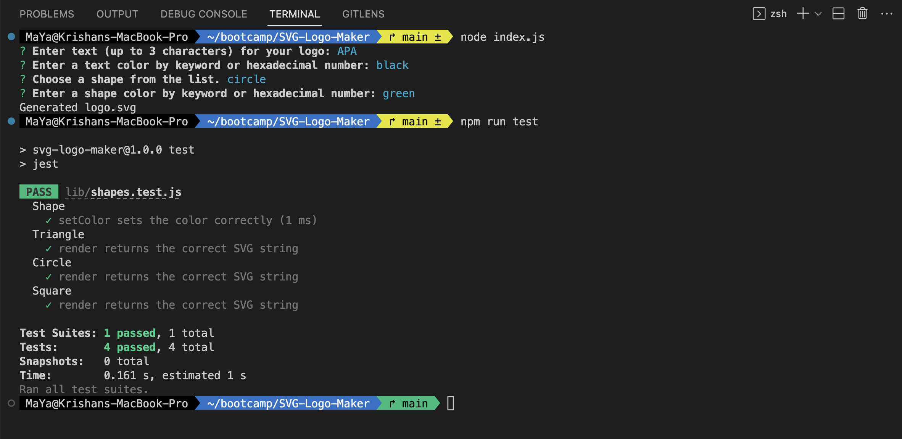

# SVG Logo Maker 

## Description

This application was built using command-line application using Node.js that generates a `.svg` file based on the user input. The user will be prompted to enter a color, shape and provide text for the logo then `logo.svg` file will be generated.
Please visit a video demonstrating the application [here](https://drive.google.com/file/d/13T55JAO_xy7RKbkyilCwBuYY7X3yY_ek/view?usp=sharing).

## Table of Contents
- [Installation](#installation)
- [Usage](#usage)
- [Credit](#credit)
- [License](#license)

## Installation
- Clone the repo on your local
- Install the packages: run `npm i` on your terminal
- Please run `npm run test` to run the unit test
- Please run `node index.js` to invoke the application

## Usage 
1. Screenshot below shows the command-line application

2. Screenshot below shows the generated logo.svg file

  

## Credit
- Assistance from tutor 
- [Inquirer.js/packages/inquirer/examples/list.js](https://github.com/SBoudrias/Inquirer.js/blob/master/packages/inquirer/examples/list.js)
- [Jest](https://www.npmjs.com/package/jest)
- [Bootcamp Gitlab 10-Object-oriented Programming](https://git.bootcampcontent.com/University-of-Adelaide/UADEL-VIRT-FSF-PT-03-2023-U-LOLC/-/tree/main/10-OOP)

## License
Please refer to the LICENSE in the repo.
